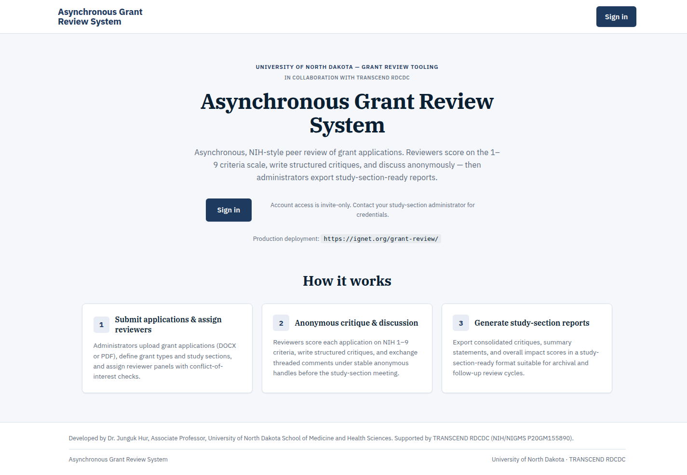
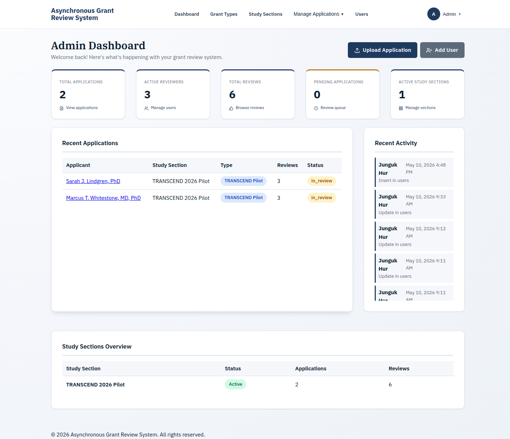
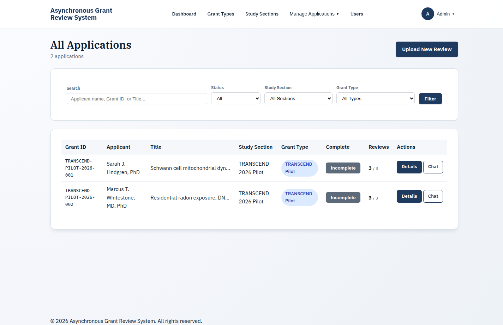
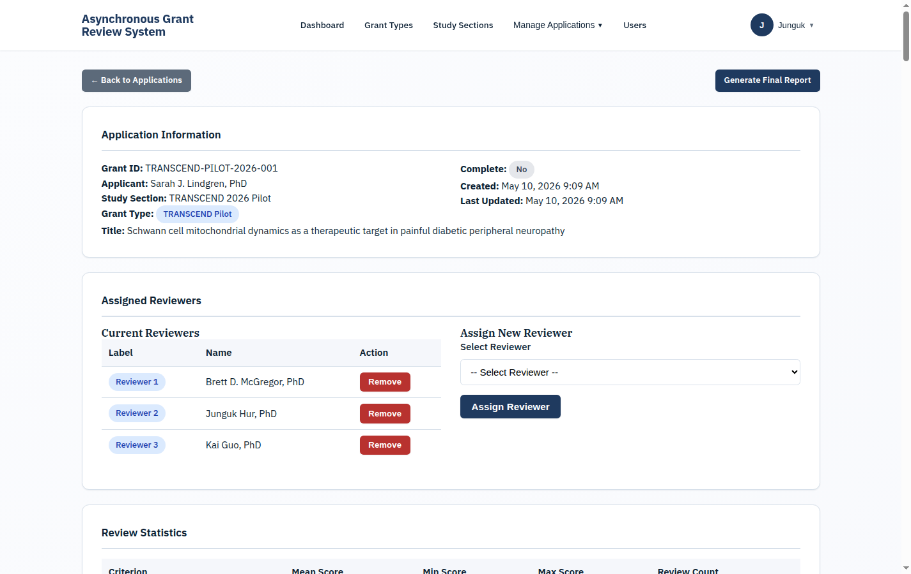
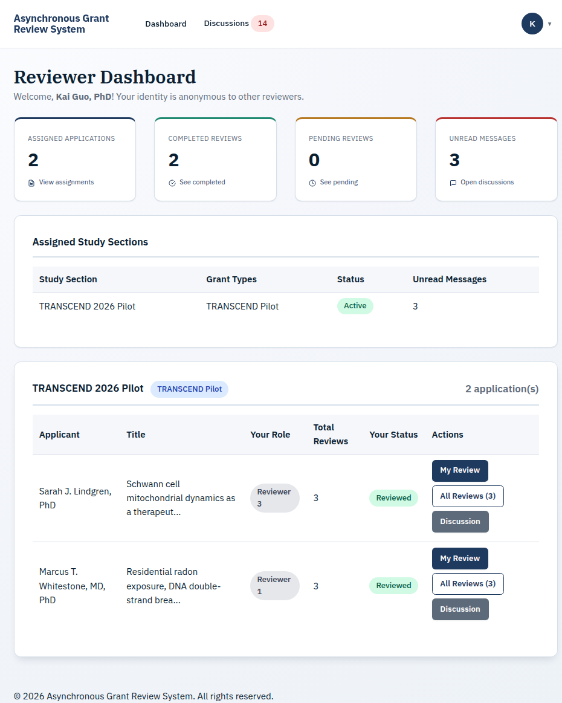
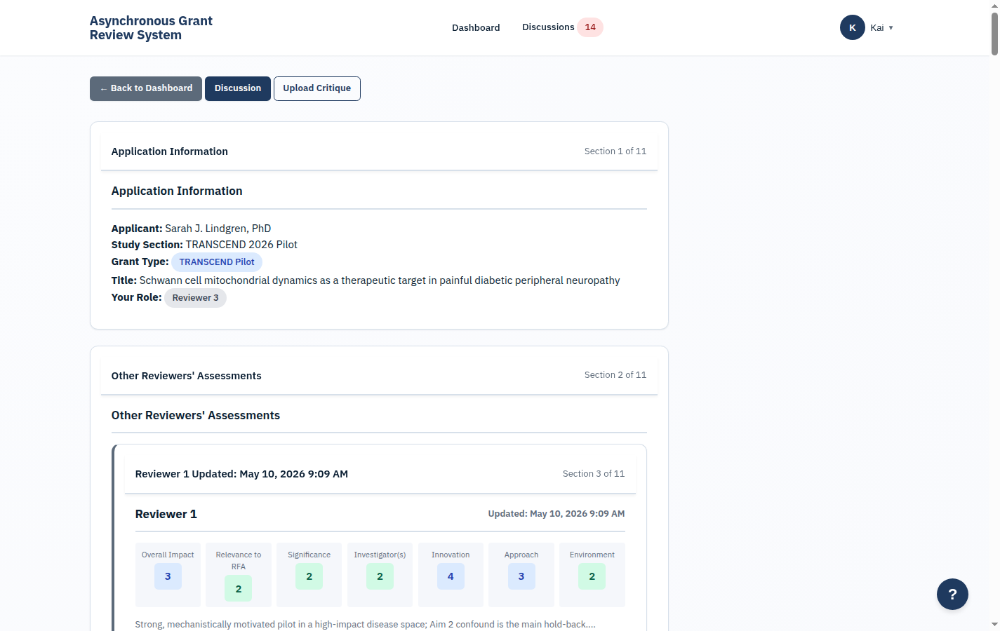
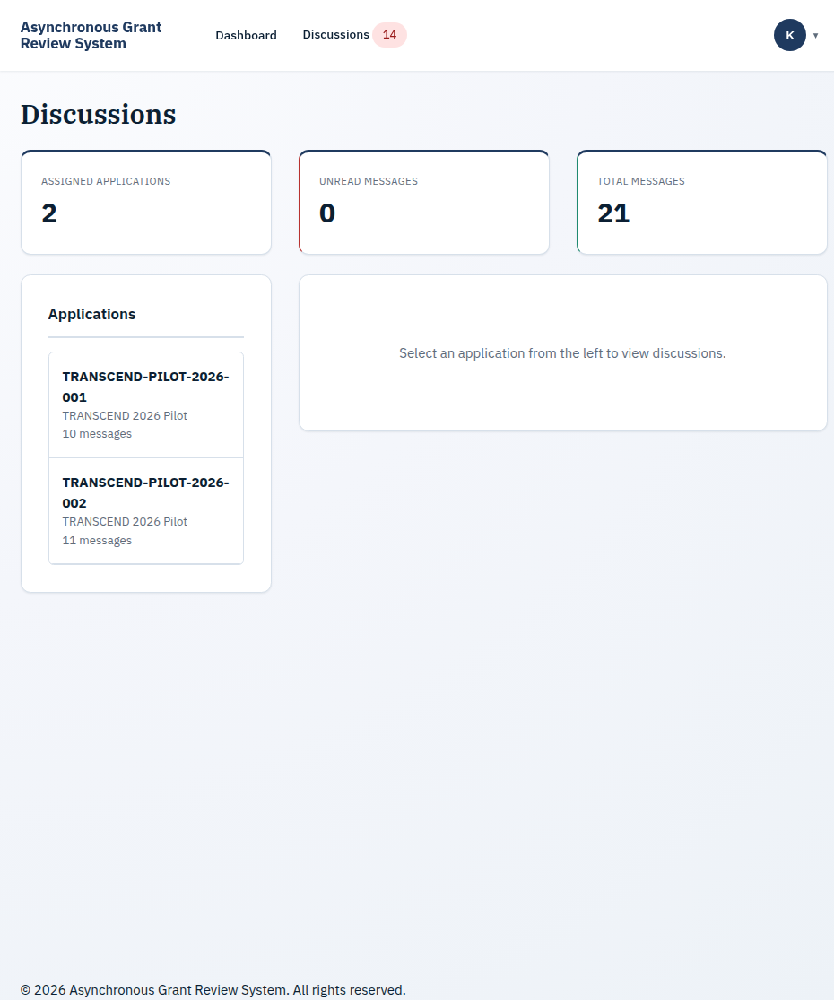
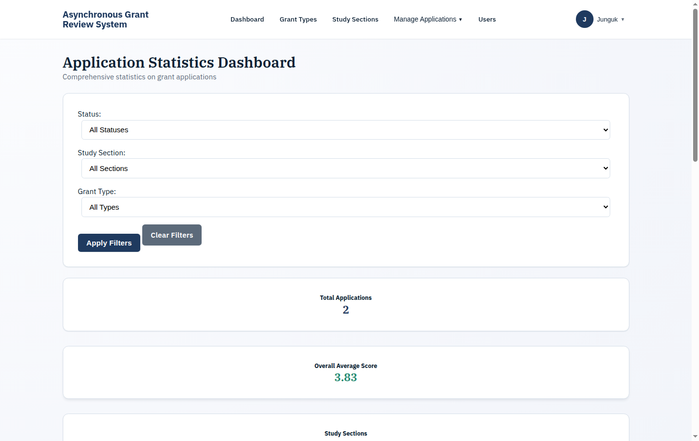

# Asynchronous Grant Review System

A web-based platform for managing NIH-style peer review of grant applications. The system enables administrators to organize review cycles and assign reviewers, while reviewers evaluate applications using structured 1-9 criteria scoring — all asynchronously and with full reviewer anonymity.

Built for research institutions and funding agencies that need to coordinate multi-reviewer grant evaluations without requiring synchronous meetings.

## Screenshots

### Public Landing Page

The `/` (and `/welcome.php`) landing page introduces the project to guests, links to sign-in, and lists the production deployment URL. Authenticated users are redirected to their role dashboard; the brand wordmark always returns here.

### Admin Dashboard

The admin dashboard provides an at-a-glance overview of applications, reviewers, reviews, and study sections, along with recent activity.

### Application Management

Browse, search, and filter all applications with server-side pagination. Manage reviewer assignments and track review progress.

### Application Detail & Reviews

Detailed view of each application showing assigned reviewers, review statistics, individual review scores, and discussion threads.

### Reviewer Dashboard

Reviewers see their assigned applications organized by study section, with status badges and quick actions for submitting reviews, viewing peer reviews, and joining discussions.

### Review Form

Structured review form with NIH-style criteria sections (Significance, Investigator, Innovation, Approach, Environment), 1-9 scoring, and rich-text bullet-point editors for strengths and weaknesses.

### Anonymous Discussions

Threaded discussion forum where reviewers communicate about applications while maintaining anonymity (identified as Reviewer A, B, C, etc.).

### Application Statistics

Filterable statistics dashboard showing application distribution by status, study section, and grant type.

## Live Demo Walkthrough

> ## ⚠️ ALL DEMO CONTENT IS FICTIONAL
>
> **The applications, principal investigators, critiques, scores, and discussion comments shown in screenshots and on the live demo at `https://ignet.org/grant-review/` are entirely fabricated for demonstration purposes.** Any resemblance to real grant proposals, researchers, institutions, or NIH funding decisions is coincidental. None of the science, scoring, or reviewer commentary represents an actual peer review.

The reference deployment at `https://ignet.org/grant-review/` is seeded with two pilot applications and a complete async-discussion thread for each. The seed mirrors a realistic NIH study section in miniature, scoped to the **TRANSCEND Pilot 2026 Spring** cycle.

### Demo applications

| Grant ID | PI | Title | Lead reviewer |
|---|---|---|---|
| TRANSCEND-PILOT-2026-001 | Sarah J. Lindgren, PhD (UND) | Schwann cell mitochondrial dynamics as a therapeutic target in painful diabetic peripheral neuropathy | Reviewer 1 |
| TRANSCEND-PILOT-2026-002 | Marcus T. Whitestone, MD, PhD (UND) | Residential radon exposure, DNA double-strand break signatures, and lung adenocarcinoma risk in Northern Plains rural cohorts | Reviewer 1 |

Each application carries:

- 3 anonymized reviewer assignments (Reviewer 1 = lead, Reviewer 2 = second, Reviewer 3 = third)
- 3 complete critiques: NIH-format Overall Impact, Relevance to RFA, Significance, Investigators, Innovation, Approach, Environment, and Budget — each with score (1-9), strengths, weaknesses, and a summative comment
- An async discussion thread (~10 messages backdated over 5 days) showing the reviewers opening with their preliminary scores, debating specific aims and analytic decisions, and converging on final scores

### Suggested walkthrough order

1. **Sign in as a reviewer** — see the dashboard with both applications listed under TRANSCEND Pilot 2026 Spring
2. **Open one application's review form** — the form auto-loads the saved critique with all eight section scores filled in
3. **Visit the discussion tab** — read the back-and-forth between reviewers and the convergence on final scores
4. **Sign out, sign in as admin** — open the same application; the admin view de-anonymizes reviewer identities and shows side-by-side score comparison
5. **Generate a report** — admin Reports → Generate Report produces an aggregated review with score statistics
6. **Try the upload-review flow** — admin → Upload Review accepts a .docx review report; `sampleReports/Edwards_A_Pilot App_Report.docx` is a structurally correct sample that the parser will accept

### Reseeding

The seed script is idempotent and lives under `deploy/ignet/` (private deployment artifacts directory):

```bash
bash deploy/ignet/apply-seed-pilot-demo.sh
```

It is safe to re-run: existing rows are updated rather than duplicated, and the discussion thread is rebuilt cleanly each time.

## Key Features

- **Structured Review Workflow** - NIH-style criteria scoring (1-9 scale) with configurable review sections per grant type
- **Reviewer Anonymity** - Reviewers are identified as Reviewer A, B, C to each other; only admins see real identities
- **Anonymous Discussions** - Threaded per-application discussion forums that preserve reviewer anonymity
- **Document Upload & Parsing** - Upload DOCX review documents with automatic parsing into structured review data
- **Study Section Management** - Organize applications into study sections (program calls) with reviewer assignments
- **Grant Type Templates** - Configurable review criteria templates for different grant mechanisms
- **Draft Auto-Save** - Reviewers can save review drafts and return to complete them later
- **Report Generation** - Generate aggregated review reports with scores across all reviewers
- **Reviewer Analytics** - Track reviewer workload, completion rates, and scoring patterns
- **Audit Logging** - Comprehensive audit trail for all administrative actions
- **Dark Mode** - Full dark mode support across all pages

## Technology Stack

| Layer | Technology |
|-------|-----------|
| Backend | PHP 8.2+, PDO |
| Database | MariaDB 11.4, InnoDB |
| Frontend | HTML5, CSS3, Vanilla JavaScript |
| Security | HTMLPurifier, bcrypt, CSRF tokens, CSP headers |
| Testing | PHPUnit 10.5, Vitest |
| Deployment | Docker, Docker Compose |
| CI/CD | GitHub Actions |

## Quick Start (Docker)

```bash
# 1. Clone and configure
git clone https://github.com/CTR-TRANSCEND/async-grant-review.git
cd async-grant-review
cp .env.example .env
# Edit .env with your database passwords

# 2. Start services
docker compose up -d

# 3. Access the system
open http://localhost:8080
```

The default admin account is created during database initialization. Change the password on first login.

## Quick Start (Apache)

```bash
# 1. Install PHP dependencies
composer install

# 2. Configure environment
cp .env.example .env
# Edit .env: set DB_HOST, DB_USER, DB_PASS, DB_NAME

# 3. Create database and import schema
mysql -u root -p -e "CREATE DATABASE grant_review"
mysql -u root -p grant_review < database/schema.sql

# 4. Point Apache to the project directory
# Enable mod_rewrite and mod_headers
```

## Configuration

All configuration is via environment variables. See `.env.example` for the complete list.

Key variables:

| Variable | Description | Default |
|----------|-------------|---------|
| `DB_HOST` | Database hostname | `localhost` |
| `DB_NAME` | Database name | `grant_review` |
| `DB_USER` | Database username | — |
| `DB_PASS` | Database password | — |
| `APP_ENV` | Environment (`production` / `development`) | `production` |
| `APP_PORT` | Application port (Docker) | `8080` |
| `SESSION_LIFETIME` | Session timeout in seconds | `3600` |
| `MARIADB_ROOT_PASSWORD` | Database root password (Docker only) | — |

## Project Structure

```
admin/              Admin pages (dashboard, users, applications, reports, analytics)
reviewer/           Reviewer pages (dashboard, review form, discussions, all reviews)
includes/           PHP classes and helper functions (37 classes)
config/             Configuration, environment loading, database connection
database/           Schema definition and migration files (22 migrations)
assets/css/         Stylesheets (8 files)
assets/js/          JavaScript modules (10 files)
tests/              PHPUnit and Vitest test suites
docs/               User manual and screenshots
docker/             Docker configuration (php.ini)
```

## Testing

### PHP Tests
```bash
composer install
cp phpunit.xml.dist phpunit.xml
# Edit phpunit.xml with your test database credentials
vendor/bin/phpunit          # 336 tests, 886 assertions
```

### JavaScript Tests
```bash
npm install
npx vitest run              # 27 tests
```

## Documentation

- **[User Manual](docs/USER_MANUAL.md)** - Complete guide for administrators and reviewers
- **[Site Structure](SITE_STRUCTURE_DOCUMENTATION.md)** - Technical system documentation
- **[Installation Checklist](INSTALLATION_CHECKLIST.md)** - Step-by-step deployment guide

## Security

- All user input sanitized via HTMLPurifier
- Prepared statements for all database queries (zero SQL injection surface)
- CSRF token validation on all POST endpoints
- Content Security Policy, X-Frame-Options, and HSTS headers
- bcrypt password hashing with progressive account lockout
- Role-based access control with IDOR protection on all endpoints
- MFA support with TOTP and backup codes

## License

Proprietary - All rights reserved.
