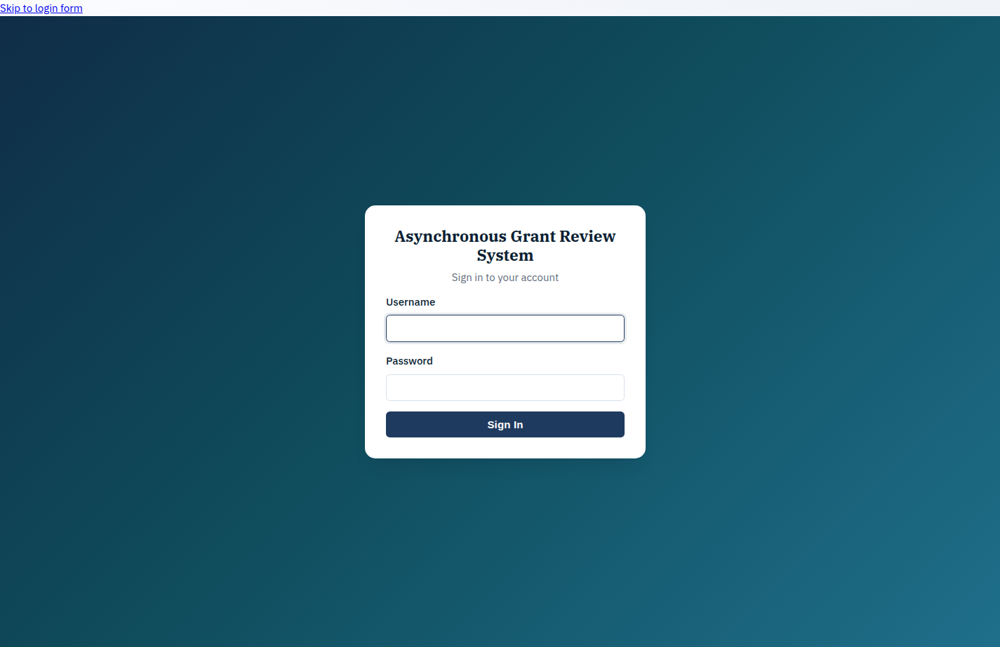
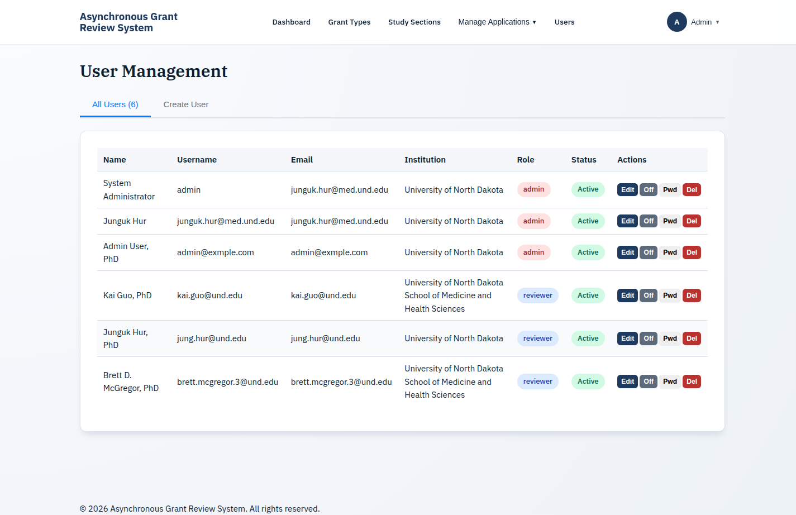
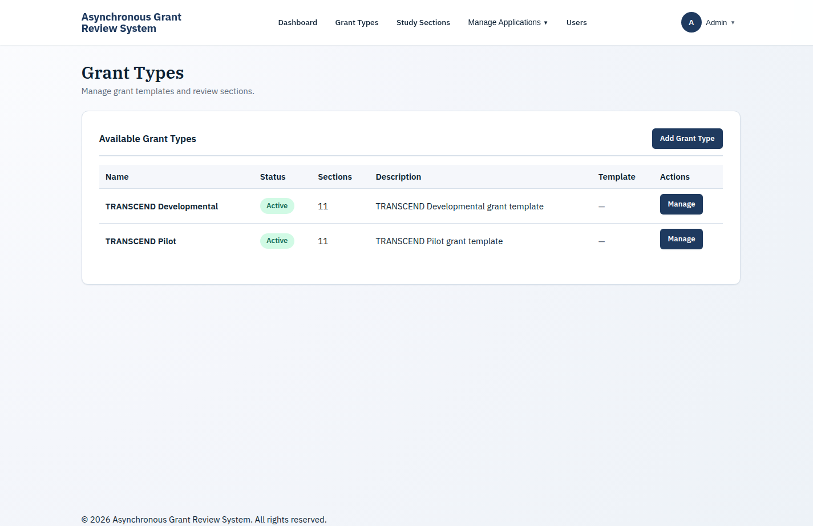
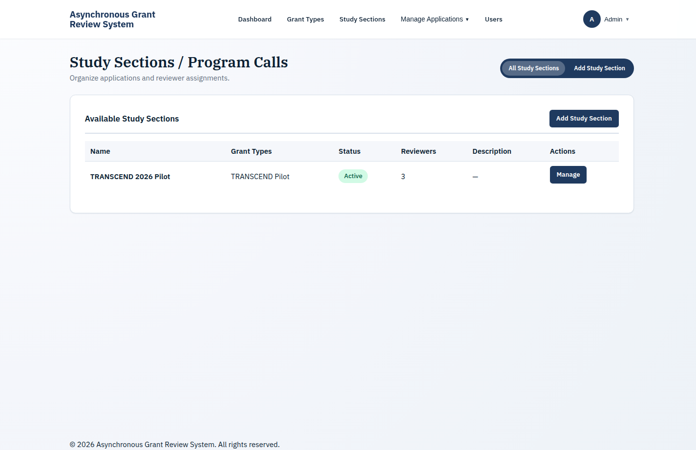
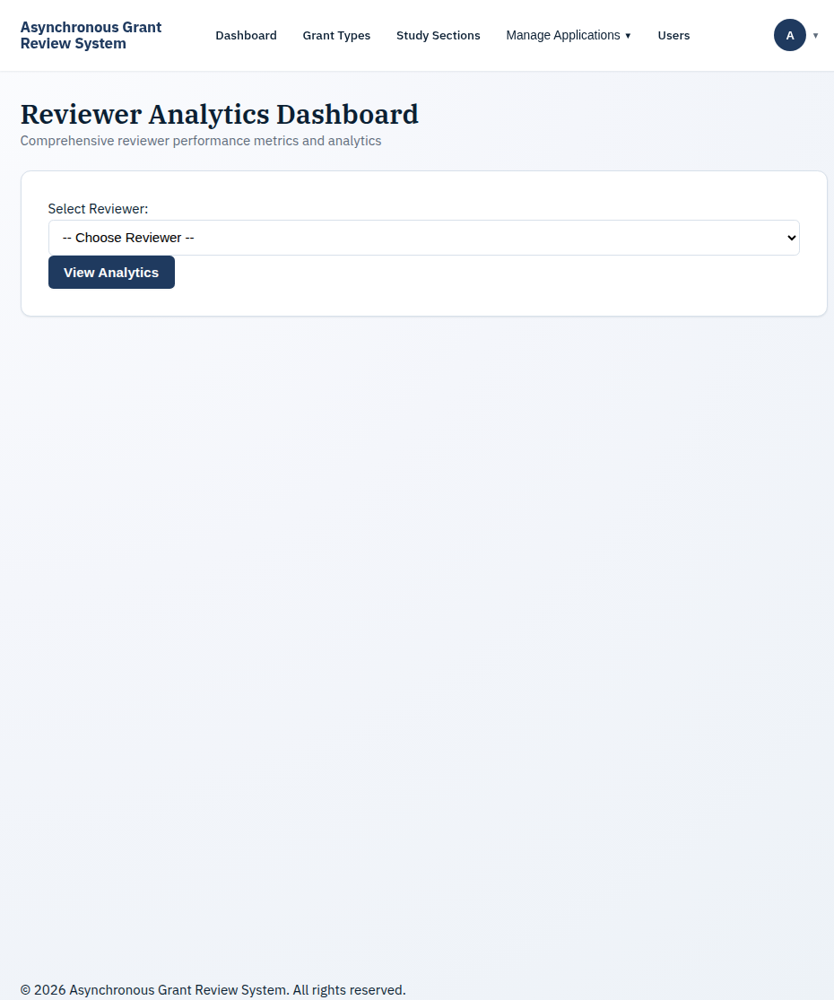
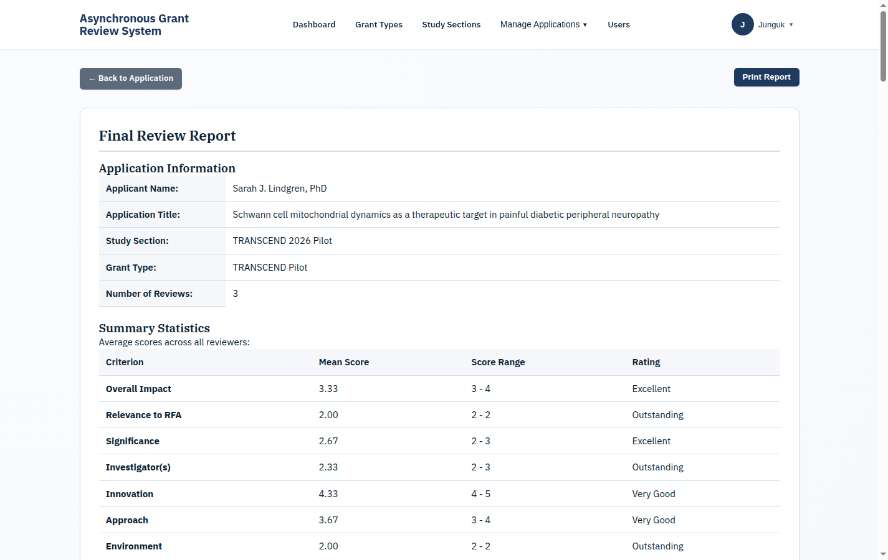
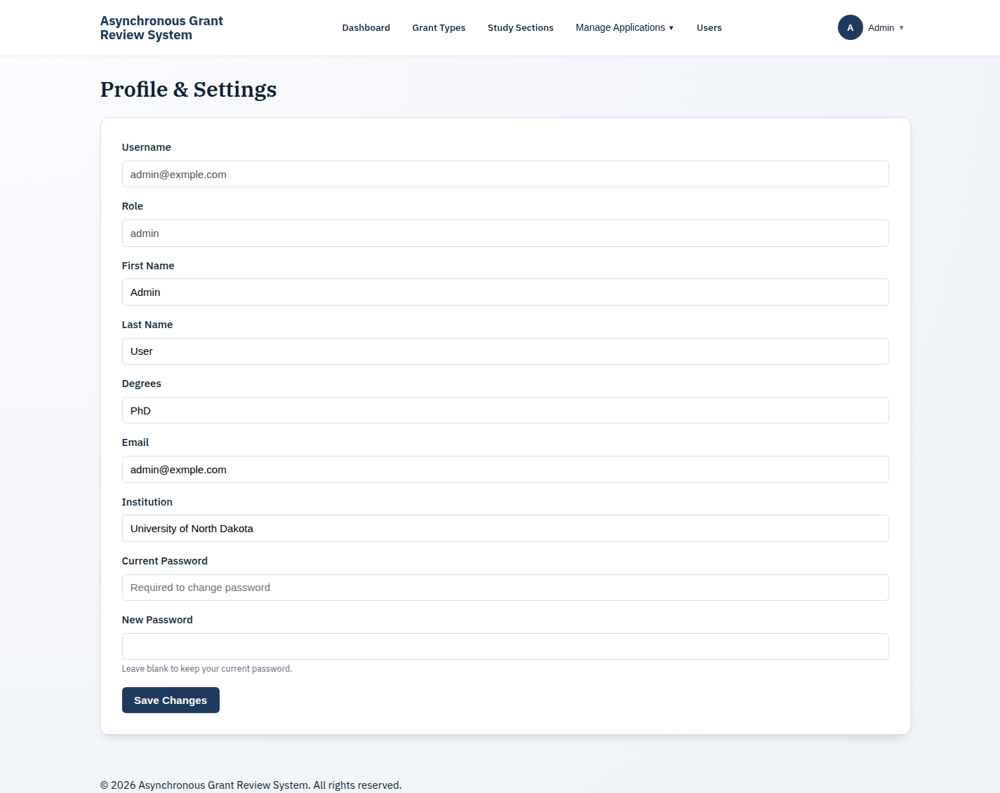
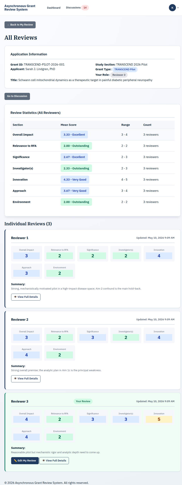

# Asynchronous Grant Review System - User Manual

## Table of Contents

1. [Introduction](#1-introduction)
2. [Getting Started](#2-getting-started)
3. [Administrator Guide](#3-administrator-guide)
4. [Reviewer Guide](#4-reviewer-guide)
5. [Common Tasks](#5-common-tasks)
6. [Troubleshooting](#6-troubleshooting)

---

## 1. Introduction

The Asynchronous Grant Review System is a web-based platform designed for research institutions and funding agencies to manage NIH-style peer review of grant applications. It replaces the need for synchronous study section meetings by allowing reviewers to evaluate applications, submit scores, and discuss with peers — all asynchronously and with full reviewer anonymity.

### Key Concepts

- **Study Section**: A panel or program call (e.g., "TRANSCEND 2025") that groups related applications for review.
- **Grant Type**: The funding mechanism (e.g., "TRANSCEND Pilot", "TRANSCEND Developmental") that determines the review criteria template.
- **Reviewer Assignment**: Each application is assigned multiple reviewers (Reviewer A, B, C, etc.). Reviewer identities are hidden from each other.
- **Review Criteria**: NIH-style review sections (Significance, Investigator, Innovation, Approach, Environment) scored on a 1-9 scale.
- **Discussion**: Anonymous threaded conversations about each application, visible only to assigned reviewers.

### User Roles

| Role | Description |
|------|-------------|
| **Administrator** | Manages applications, users, study sections, grant types, reviewer assignments, and generates reports. Can see reviewer identities. |
| **Reviewer** | Reviews assigned applications, submits scores and critiques, participates in anonymous discussions. Cannot see other reviewers' identities. |

### Live Demo Content

> ## ⚠️ ALL DEMO CONTENT IS FICTIONAL
>
> **The applications, principal investigators, critiques, scores, and discussion comments in this manual and on the live demo are entirely fabricated for instructional purposes.** Any resemblance to real grants, researchers, institutions, or peer-review decisions is coincidental. None of the science or scoring shown represents an actual NIH review.

The reference deployment is seeded with two pilot applications and complete reviewer critiques + async discussion threads to illustrate every workflow described in this manual. The two demo applications are:

- **TRANSCEND-PILOT-2026-001** — *Schwann cell mitochondrial dynamics as a therapeutic target in painful diabetic peripheral neuropathy* (Sarah J. Lindgren, PhD)
- **TRANSCEND-PILOT-2026-002** — *Residential radon exposure, DNA double-strand break signatures, and lung adenocarcinoma risk in Northern Plains rural cohorts* (Marcus T. Whitestone, MD, PhD)

Both applications are at status **In Review** with three reviewers each, full NIH-format critiques (Overall Impact, Relevance, Significance, Investigators, Innovation, Approach, Environment, Budget), and an async discussion thread spanning roughly five days of message exchange. Following the screenshots in this manual against the live system will land you on these same applications.

---

## 2. Getting Started

### Public Landing Page

Visiting the system URL while signed out shows a public landing page that introduces the project, lists the production deployment URL, and provides a **Sign in** button. The brand wordmark in the top-left of every page links back to this landing page, so authenticated users can always return to it for the project overview.

Account access is invite-only. Contact your study-section administrator for credentials if you do not yet have an account.

### Logging In

Click **Sign in** from the landing page (or navigate directly to `/login.php`) to reach the login form.

Enter your username and password, then click **Sign In**. After successful authentication, you will be redirected to the appropriate dashboard based on your role.

### First Login

If this is your first time logging in, you should:

1. Change your password via the **Profile** page (accessible from the user menu in the top-right corner)
2. Review your profile information (name, email, institution)
3. Optionally enable Multi-Factor Authentication (MFA) for enhanced security

### Navigation

- **Administrators** see a navigation bar with: Dashboard, Grant Types, Study Sections, Manage Applications, Users
- **Reviewers** see a navigation bar with: Dashboard, Discussions
- Both roles can access Profile and Logout from the user menu in the top-right corner

---

## 3. Administrator Guide

### 3.1 Dashboard

The admin dashboard provides a high-level overview of the system:

- **Summary Cards**: Total applications, active reviewers, total reviews, pending applications, and active study sections
- **Recent Applications**: Table of the most recent applications with their study section, grant type, review count, and status
- **Recent Activity**: Timeline of administrative actions (user management, application changes, etc.)
- **Study Sections Overview**: Status and application count for each study section

### 3.2 Managing Applications

#### Viewing All Applications

The **All Applications** page shows every application in the system with:

- **Search**: Filter by applicant name, grant ID, or title
- **Filters**: Narrow by Status, Study Section, or Grant Type
- **Pagination**: 25 applications per page with page navigation
- **Actions**: Click **Details** to view full application info, or **Chat** to view the discussion thread

#### Uploading Applications

1. Click **Upload New Review** from the Applications page or Dashboard
2. Select a DOCX file containing the grant review document
3. The system automatically parses the document to extract:
   - Applicant information
   - Grant ID and title
   - Review criteria sections (if present)
4. Assign the application to a study section and grant type
5. Click **Upload** to save

#### Application Detail

The application detail page shows:

- **Application Information**: Grant ID, applicant, title, study section, grant type, creation date
- **Assigned Reviewers**: Current reviewer assignments with their roles (Reviewer A, B, C) and review status. You can assign new reviewers from this page.
- **Review Statistics**: Aggregate scores across all reviewers for each criteria section, showing mean, min, max, and median
- **All Reviews**: Individual reviews from each reviewer showing their scores and critiques for every criteria section
- **Discussion**: Message thread for this application (visible to assigned reviewers and admins)

#### Managing Applications (Bulk)

Navigate to **Manage Applications** from the navigation bar to:

- Assign applications to study sections in bulk
- Set grant types for multiple applications
- Manage reviewer assignments across applications

### 3.3 User Management

Navigate to **Users** to manage system accounts:

- **Add User**: Click the **Add User** button. Provide username, password, full name, email, institution, and role (admin or reviewer).
- **Edit User**: Click on a user to modify their information or role.
- **Activate/Deactivate**: Toggle user accounts on or off without deleting them.
- **Bulk Import**: Download the CSV template, fill in user data, and upload to create multiple accounts at once.

### 3.4 Grant Types

Grant types define the review criteria template used for evaluating applications. Each grant type specifies which review sections reviewers must score.

- **Create Grant Type**: Define a name, description, and configure the review sections (e.g., Significance, Investigator, Innovation, Approach, Environment)
- **Edit Grant Type**: Modify review section configurations
- **Activate/Deactivate**: Control which grant types are available for new applications

### 3.5 Study Sections

Study sections represent program calls or review panels. They group related applications together and organize the review cycle.

- **Create Study Section**: Define a name and description
- **Manage Membership**: Assign reviewers to study sections
- **Activate/Deactivate**: Control study section availability

### 3.6 Application Statistics

The **Application Stats** page provides filterable analytics:

- **Summary Metrics**: Total applications, overall average score, study section count, grant type count
- **Applications by Status**: Breakdown showing pending, in review, and completed counts with percentages
- **Applications by Study Section**: Distribution across study sections
- **Applications by Grant Type**: Distribution across grant types

Use the filter dropdowns (Status, Study Section, Grant Type) to narrow the view.

### 3.7 Reviewer Analytics

Track reviewer performance and workload:

- **Completion Rates**: Percentage of assigned reviews completed by each reviewer
- **Scoring Patterns**: Average scores and standard deviation per reviewer
- **Workload Distribution**: Number of assignments per reviewer

### 3.8 Report Generation

Generate aggregated review reports:

1. Navigate to **Generate Report** (accessible from application detail or the dashboard)
2. Select the application(s) to include
3. The report aggregates scores from all reviewers, showing:
   - Per-criteria averages, min, max, and median
   - Individual reviewer critiques (anonymized)
   - Overall impact scores
4. Export as needed for committee review

### 3.9 Profile Management

Both administrators and reviewers can manage their profile:

- **Update Information**: Change full name, email, institution
- **Change Password**: Requires current password for security
- **Multi-Factor Authentication**: Enable/disable TOTP-based MFA with backup codes

---

## 4. Reviewer Guide

### 4.1 Reviewer Dashboard

After logging in, reviewers see their dashboard showing:

- **Summary Cards**: Assigned applications, completed reviews, pending reviews, unread discussion messages
- **Assigned Study Sections**: Study sections you are a member of
- **Application List**: All assigned applications grouped by study section, showing:
  - Applicant name and title
  - Your reviewer role (Reviewer A, B, C)
  - Total reviews submitted and your review status
  - Action buttons: **Submit Review** / **My Review**, **All Reviews**, **Discussion**

### 4.2 Submitting a Review

To submit a review:

1. Click **Submit Review** next to the application on your dashboard
2. The review form presents each criteria section defined by the grant type:
   - **Overall Impact**: Your overall assessment of the application
   - **Significance**: Importance of the problem and potential impact
   - **Investigator(s)**: Qualifications and experience of the research team
   - **Innovation**: Novelty of the approach
   - **Approach**: Quality of the research design and methodology
   - **Environment**: Adequacy of the institutional resources and support
   - Additional sections as configured by the grant type template
3. For each section:
   - **Score**: Select a score from 1 (Exceptional) to 9 (Poor)
   - **Strengths**: Use the bullet-point editor to list strengths
   - **Weaknesses**: Use the bullet-point editor to list weaknesses
4. Click **Save Draft** to save your work and return later
5. Click **Submit Review** to finalize your review

#### Scoring Scale

| Score | Descriptor | Description |
|-------|-----------|-------------|
| 1 | Exceptional | Essentially no weaknesses |
| 2 | Outstanding | Extremely minor weaknesses |
| 3 | Excellent | Minor weaknesses |
| 4 | Very Good | Minor weaknesses |
| 5 | Good | Moderate weaknesses |
| 6 | Satisfactory | Moderate weaknesses |
| 7 | Fair | Major weaknesses |
| 8 | Marginal | Major weaknesses |
| 9 | Poor | Severe weaknesses |

#### Editing a Submitted Review

After submitting, click **My Review** to view or edit your review. You can modify scores and critiques until the review cycle closes.

### 4.3 Viewing All Reviews

Click **All Reviews** next to an application to see reviews from all assigned reviewers. Reviewers are identified anonymously (Reviewer A, Reviewer B, etc.) — you will not see other reviewers' real names.

This page shows:
- Each reviewer's scores across all criteria sections
- Aggregate statistics (mean, min, max)
- Individual critiques from each reviewer

### 4.4 Discussions

The **Discussions** page provides a threaded messaging system for each application:

1. Navigate to **Discussions** in the navigation bar or click **Discussion** next to an application
2. Select an application from the left panel to view its discussion thread
3. Type your message in the text box and click **Send Message**
4. Messages are attributed to your anonymous reviewer role (e.g., "Reviewer A") — other reviewers cannot see your real identity

Discussion features:
- **Unread Badge**: The navigation bar shows a count of unread messages
- **Message History**: Full chronological thread for each application
- **Anonymity**: All messages display reviewer role labels, not real names

---

## 5. Common Tasks

### Changing Your Password

1. Click your name/avatar in the top-right corner
2. Select **Profile**
3. Enter your **current password** in the security section
4. Enter and confirm your **new password**
5. Click **Update Password**

### Enabling Multi-Factor Authentication

1. Go to **Profile**
2. In the MFA section, click **Enable MFA**
3. Scan the QR code with an authenticator app (Google Authenticator, Authy, etc.)
4. Enter the verification code from your authenticator
5. Save the backup codes in a secure location — these allow login if you lose your authenticator

### Navigating Dark Mode

Click the theme toggle in the navigation bar or user menu to switch between light and dark modes. Your preference is saved automatically.

---

## 6. Troubleshooting

### Cannot Log In

- Verify your username and password are correct (passwords are case-sensitive)
- If your account is locked due to failed attempts, wait for the lockout period to expire or contact an administrator
- If MFA is enabled, ensure your authenticator app's clock is synchronized

### Review Form Not Saving

- Ensure all required score fields are filled in
- Check your internet connection — the system requires an active connection to save
- Try clicking **Save Draft** to preserve your work before submitting

### Discussion Messages Not Appearing

- Refresh the page to see new messages
- Ensure you are viewing the correct application's discussion thread
- Only reviewers assigned to the application can see its discussions

### Contact Support

If you encounter issues not covered here, contact your system administrator.

---

*Asynchronous Grant Review System - User Manual*
*Last updated: March 2026*
